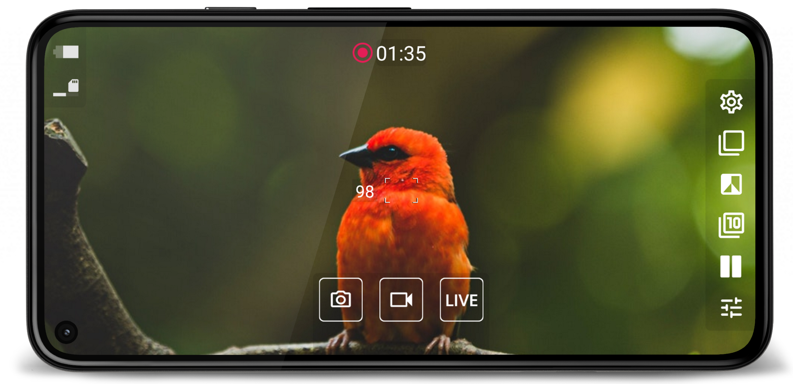
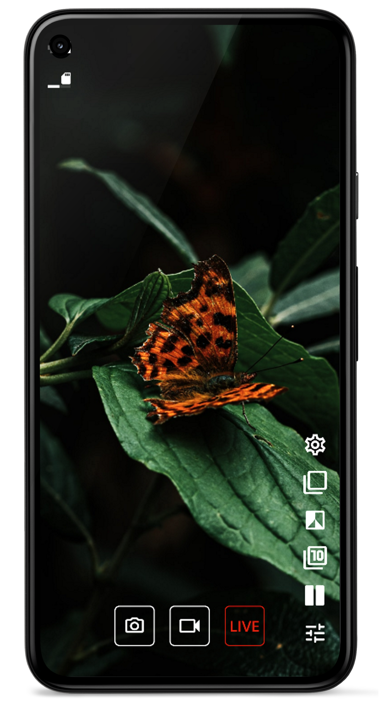
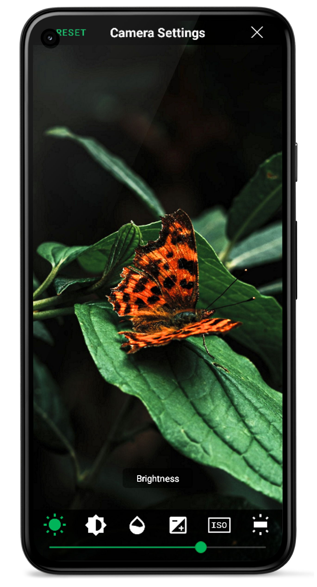

<h1 align="center">
  </img>
  BinoCam Pro
</h1>

BinoCam Pro is a mobile application developed for birdwatchers, professional sports shooters, hunters, forestry and conservation organizations, security professionals, life-rescue teams, and outdoor enthusiasts. BinoCam Pro integrates Spark Lab’s electro-optic units with mobile devices (smartphones, tablets). It provides a higher level of comfort in controlling the units, extends functional capabilities of units, as well as adds new application scenarios.  
BinoCam Pro is an application that provides connection of your mobile devices with observation devices of Spark Lab via an integrated Wi-Fi interface. The application provides full control of the observation device and its features.

<h3>10x Zoom</h3>

<h3>Dual screen mode</h3>

| <h3>Live stream</h3> | <h3>Image setting</h3> |
| --- | --- |
|

  <a href="https://sparklabdev.github.io/legal/terms">Terms of Use</a> and <a href="https://sparklabdev.github.io/legal/privacy">Privacy Policy</a>

